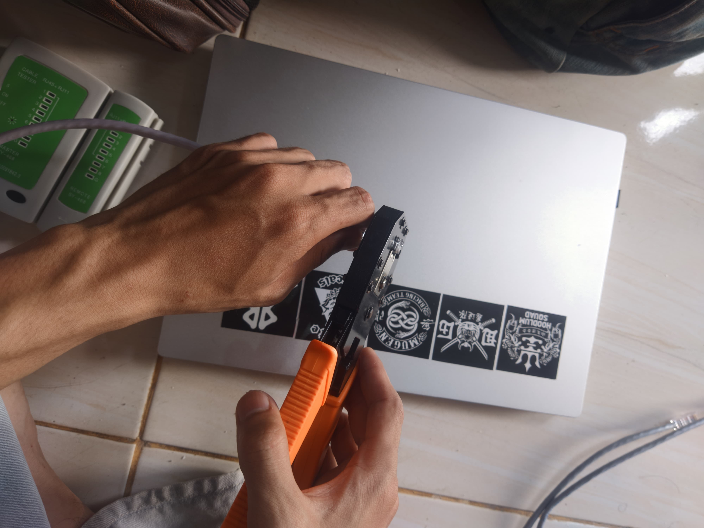
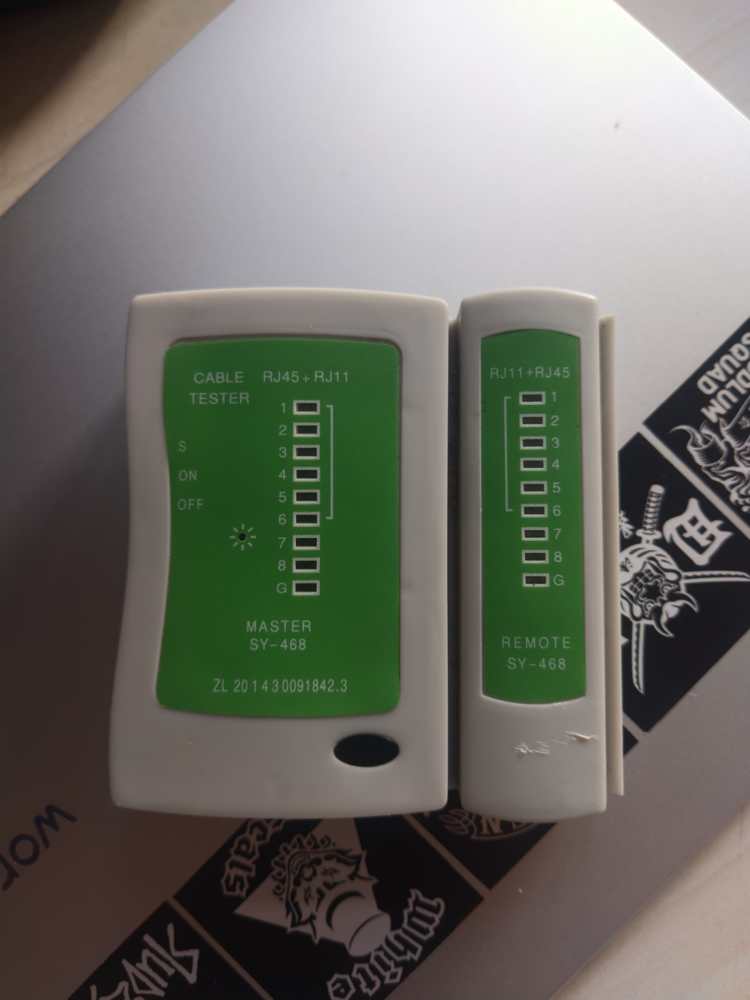

📌 Laporan Praktikum Jaringan Komputer

  <table>
        <tr>
            <th>Nama</th>
            <td>: yasyir masy'al</td>
        </tr>
        <tr>
            <th>Kelas</th>
            <td>: Tk 4 B</td>
        </tr>
        <tr>
            <th>Nim</th>
            <td>: 09030282327049</td>
        </tr>
    </table>

<h1 style="font-weight: bold;">
  JUDUL PERCOBAAN
</h1 >

<h2>Membuat / griping Kabel Straight dan cross</h2>

<h3> Alat dan Bahan </h3>
 
 <h4>Kabel UTP</h4>

 
 
 
 <h4>Konektor RJ454</h4>
 
 
 
 
 <h4>Crimping Tool</h4>

 
 
 
 <h4>Lan Cable Tester</h4>

<h2>Hasil Percobaan</h2>

Pada percobaan ini, saya melakukan proses pembuatan kabel jaringan
menggunakan Kabel UTP (Unshielded Twisted Pair) dengan konektor RJ45, alat penjepit Crimping
Tool, dan pengujian menggunakan LAN Cable Tester.

<h3>Berikut adalah langkah-langkah untuk crimping kabel UTP</h3>

<ol>
  <li>Potong kabel UTP: Potong kabel UTP sesuai dengan panjang yang dibutuhkan</li>
  <li>Buka isolasi kabel: Buka isolasi kabel UTP dengan menggunakan alat pembuka isolasi</li>
   
  <li>Urutkan kabel: Urutkan kabel UTP sesuai dengan standar TIA/EIA-568-B (putih-oranye, oranye, putih-hijau, biru, putih-biru, hijau, putih-coklat, coklat).</li>
  <li>dan untuk cross Urutkan kabel: Urutkan kabel UTP sesuai dengan standar TIA/EIA-568-B (putih-oranye, oranye, putih-hijau, biru, putih-biru, hijau, putih-coklat, coklat), tetapi dengan urutan yang berbeda untuk kabel crossover.</li>
  
</ol>

 
 

